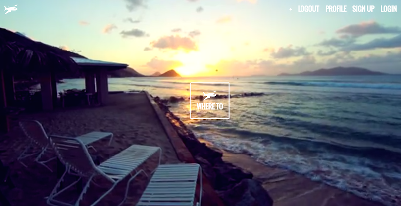
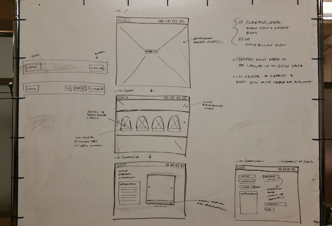
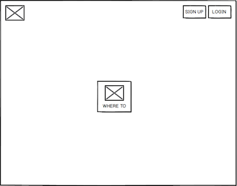
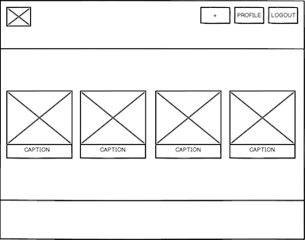
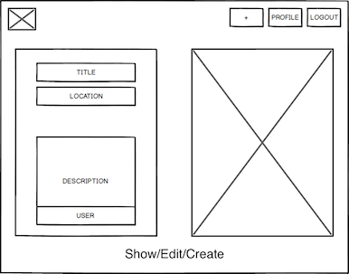
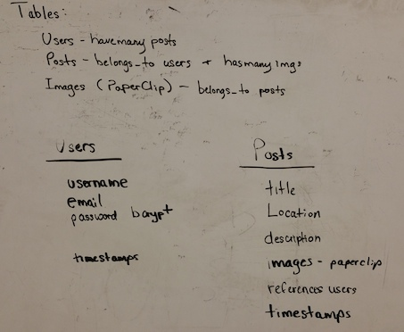

# WHERE TO
WHERE TO is an app that encourages users to explore and share images from their previous trips.  Along with the picture they can add a title, where it was taken, and a decription of their experience!  Its a great way to get to see the world through other peoples eyes.

**Built with:**
Rails, BassCss, PaperClip, JavaScript, AJAX, jQuery

**Begin your journey here:** [Where To](http://warm-atoll-6305.herokuapp.com/)

###Ideation Process
#####Wireframing - original
We began the process by wireframing a basic mockup of all the pages that we would need to deliver a simple and beautiful UX

#####Wireframing - complete
We then fleshed out the wireframes to have a clear understanding of what each page would look like and what features would be needed.

#####Schema - original
Our basic schema design subject to change

#####Schema - complete
Coming soon

##Team Members

####James Parseghian
* GitHub: https://github.com/jjparseghian
* LinkedIn: www.linkedin.com/pub/james-parseghian/13/326/304/en
* Email: jjparseghian@gmail.com

####Michael Angelo
* GitHub: https://github.com/Yamikamisama
* LinkedIn: http://www.linkedin.com/pub/michael-angelo/9a/a93/1b0/
* Email: yamikamisama@gmail.com
